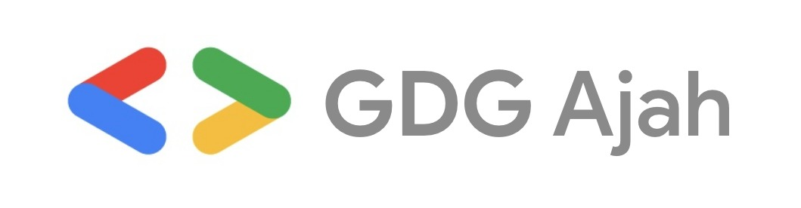

# Google Developer Group Ajah

👋 Welcome to our Community GitHub Organization! This organization serves as a hub for various activities, projects, and collaborations within our vibrant community. We're excited to have you on board and can't wait to see what we can achieve together!

## Getting Started

To get started with our community and make the most of this GitHub organization, follow these steps:

1. Sign up for a GitHub account if you don't already have one. It's quick and free!
1. Request to join the organization by visiting [Organization URL](https://github.com/GDG-Ajah) and clicking on the "Join" button.
1. Once your request is approved, you will gain access to our organization's repositories, discussions, and collaborative spaces.

## Repository Overview

Our organization hosts a variety of repositories catering to different aspects of our community, including the DSA Program. Here's an overview of the DSA Program repositories currently available:

- [Time and Space Complexity - Big O Notation](https://github.com/GDG-Ajah/Time-and-Space-Complexity--Big-O-Notation): Dive into the concept of Big O notation and learn how to analyze the time and space complexity of algorithms.
- [Array & String](https://github.com/GDG-Ajah/Arrays-and-String): Explore data structures and algorithms related to arrays and strings.
- [Linked List & Matrix](https://github.com/GDG-Ajah/Linked-List-and-Matrix): Learn about linked lists and matrices and their applications in problem-solving.
- [Stack & Queue](https://github.com/GDG-Ajah/Stack-and-Queue): Understand the concepts of stacks and queues and their implementations.
- [Heap & Hash](https://github.com/GDG-Ajah/Heap-and-Hash): Dive into heap data structures and hash tables and discover their efficient uses.
- [Tree & Graph](https://github.com/GDG-Ajah/Tree-and-Graph): Study tree and graph structures, traversal algorithms, and related algorithms.
- [Searching Algorithm](https://github.com/GDG-Ajah/Searching-Algorithm---Excercise): Learn various searching algorithms and practice exercises to enhance your skills.
- [Sorting Algorithm](https://github.com/GDG-Ajah/Sorting-Algorithm---Excercise): Explore different sorting algorithms and practice exercises to sharpen your abilities.
- [Divide and Conquer Algorithm](https://github.com/GDG-Ajah/Divide-and-Conquer-Algorithm---Excercise): Understand divide and conquer algorithms and work on related exercises.
- [Recursion, Backtracking, and Dynamic Programming](https://github.com/GDG-Ajah/Recursion-BackTracking-and-Dynamic-programming---Excercise): Deep dive into recursion, backtracking, and dynamic programming algorithms and solve exercises to reinforce your understanding.
- [Live Coding Sessions (Practice Practice Practice)](https://github.com/GDG-Ajah/Live-Coding-Sessions---Practice-Practice-Practice): Engage in live coding sessions to apply your knowledge practically.
- [Soft Skill Session: Acing Your DSA Interview](https://github.com/GDG-Ajah/Soft-Skill-Session---Acing-Your-DSA-Interview.-Competition-30mins): Enhance your soft skills and prepare for DSA-related interviews.

Feel free to explore these repositories and access the materials and exercises provided. Let's embark on this learning journey together!

## Communication and Collaboration

We believe in fostering an environment of open communication and collaboration. Connect with fellow community members, share ideas, seek help, and participate in discussions using the following channels:

- [GDG Ajah Slack Channel](https://gdgajah.slack.com/join/shared_invite/zt-1wg3udxzq-sHxFVrE_hF_H6NEsJmwhjg#/shared-invite/email)
- [GDG Ajah GitHub Discussions](https://github.com/orgs/GDG-Ajah/discussions)
- [GDG Ajah WhatsApp Community](https://chat.whatsapp.com/BPmDnFpcKyQGfAPKJJJIvi)

Join the conversation, contribute your expertise, and together, let's make our community thrive!

## Code of Conduct

As a member of our community, we expect you to adhere to our [Code of Conduct](). This ensures a safe, inclusive, and respectful environment for all community members. Please familiarize yourself with the guidelines and help us maintain a positive community experience.

## Get Involved

We encourage you to actively participate in our community activities, such as:

- Attending meetups, webinars, and workshops
- Contributing to open-source projects
- Collaborating on exciting initiatives
- Sharing knowledge through blog posts and tutorials

Stay tuned for announcements, events, and opportunities to get involved!

## Contact

If you have any questions, suggestions, or need support, don't hesitate to reach out to our community team at gdgajah1@gmail.com. We're here to assist you and make your community experience remarkable.

Thank you for joining our Community GitHub Organization. Let's build, learn, and grow together!

Happy coding!
