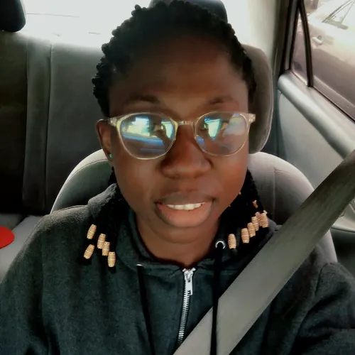

# 👋Google Developer Group Ajah Community

Welcome to the GDG Ajah Community! We are a vibrant and inclusive community of tech enthusiasts, developers, designers, and entrepreneurs based in Ajah-Lekki and its surrounding areas. We leverage on Google technologies to build innovative tech products and solutions. Our mission is to foster learning, collaboration, and innovation in the tech industry.

## About Us

At GDG Ajah, we believe in the power of community-driven learning and growth. Over the last three years, we have hosted more than 30+ meetups, workshops, conferences, and events. These gatherings have provided like-minded individuals to come together to share knowledge, explore emerging technologies, and network with industry professionals. Our community is open to everyone, from beginners to experienced professionals, who have a passion for technology.

## What We Do

- **Meetups and Events:** We regularly host meetups and events where guest speakers, industry experts, and community members share their insights, experiences, and expertise. These gatherings provide an excellent opportunity to learn, network, and connect with like-minded individuals.

- **Workshops and Hackathons:** We organize hands-on workshops and hackathons to promote practical learning and collaborative problem-solving. These events offer a platform to build projects, learn new technologies, and enhance your skills.

- **Tech Talks and Panel Discussions:** We facilitate thought-provoking tech talks and panel discussions on various topics, ranging from software development and data science to design and entrepreneurship. These sessions inspire, educate, and encourage dialogue within our community.

- **Open Source Contributions:** We actively contribute to open-source projects and encourage our community members to participate. By collaborating on open-source projects, we aim to learn, improve our skills, and give back to the wider developer community.

## Get Involved

Joining our community is easy! Here's how you can get involved:

1. **Attend Our Events:** Stay tuned for upcoming meetups, workshops, and events. Join us to learn from industry experts, engage in meaningful discussions, and expand your professional network.

2. **Contribute and Share:** Share your knowledge, insights, and experiences with the community. Whether it's through speaking at an event, writing a blog post, or leading a workshop, your contributions are valuable and help us grow together.

3. **Connect on Social Media:** Follow us on social media platforms such as Twitter, Facebook, and LinkedIn to stay updated with the latest community news, event announcements, and tech trends. Engage with our posts, share your thoughts, and connect with fellow community members.

4. **Collaborate and Network:** Connect with like-minded individuals, find potential collaborators, and expand your professional network. Engage in conversations, participate in discussions, and explore opportunities within our community.

## Join the Conversation

Join the GDG Ajah Community and be a part of the dynamic tech ecosystem in Ajah. Connect with fellow tech enthusiasts, learn new skills, and contribute to the growth of the community. Together, let's inspire, learn, and create amazing things!

- [GDG Ajah Slack Channel](https://gdgajah.slack.com/join/shared_invite/zt-1wg3udxzq-sHxFVrE_hF_H6NEsJmwhjg#/shared-invite/email)
- [GDG Ajah GitHub Discussions](https://github.com/orgs/GDG-Ajah/discussions)
- [GDG Ajah WhatsApp Community](https://chat.whatsapp.com/BPmDnFpcKyQGfAPKJJJIvi)

## Meet the Organizers

We are proud to introduce the dedicated organizers who make GDG Ajah a thriving community. Our team is passionate about technology and committed to creating engaging experiences for our members. Get to know the faces behind the scenes:

### Oluwaseyi Ayodele

Seyi is dedicated to utilizing technology to tackle both community and business challenges. He has a deep enthusiasm for pioneering solutions, educational initiatives, startup development, fostering developer communities, contributing to open-source projects, and empowering individuals through valuable learning experiences. Seyi is driven by a strong desire to share his knowledge and passion for technology, making a positive impact in the field.

Connect with Seyi: [LinkedIn](https://www.linkedin.com/in/oluwaseyiayodele/) | [Twitter](https://twitter.com/Fransunisoft)

### Loveth Nwokike

Loveth is a skilled professional in the field of Information Technology and Services. Her areas of expertise include Flutter, Android development, and mobile app development. As an integral part of our organizing team, Loveth actively contributes to the Women Techmakers community, advocating for diversity and inclusivity within the tech industry. She is also adept at technical writing, effectively conveying intricate concepts in a comprehensible manner. Loveth's unwavering passion for technology and her commitment to continuous growth make her an invaluable asset to our community.

Connect with Loveth: [LinkedIn](https://linkedin.com/in/lovethnwokike) | [Twitter](https://twitter.com/Kulloveth)

### Ogbonna Gideon

Gideon, a Senior Mobile Developer at Demz Analytics, brings a wealth of expertise to our team. Located in AJAH, he specializes in E-Learning solutions, leveraging his skills in Flutter, UX Design, and Android and iOS app development. Gideon's proficiency in these areas enables him to create engaging and user-friendly applications. As an organizer, he plays a vital role in shaping our community's events and initiatives. Gideon's dedication to delivering high-quality mobile experiences and his passion for staying at the forefront of technology make him an invaluable asset to our team.

Connect with Gideon: [LinkedIn](https://www.linkedin.com/in/ogbonnagideonc/) | [Twitter](https://twitter.com/GiddyCode)

Our organizers are here to support and guide you on your tech journey. Feel free to reach out to any of us with your questions, ideas, or suggestions. We're excited to connect with you and make your experience in GDG Ajah community a memorable one!
